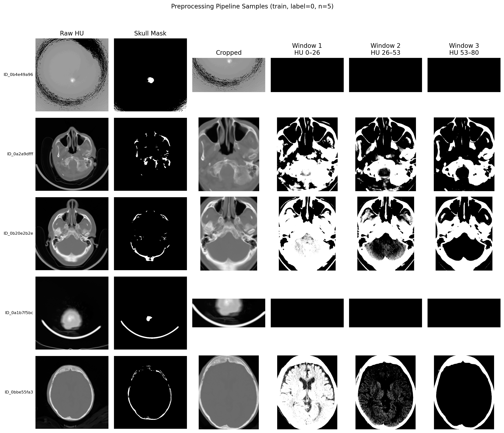
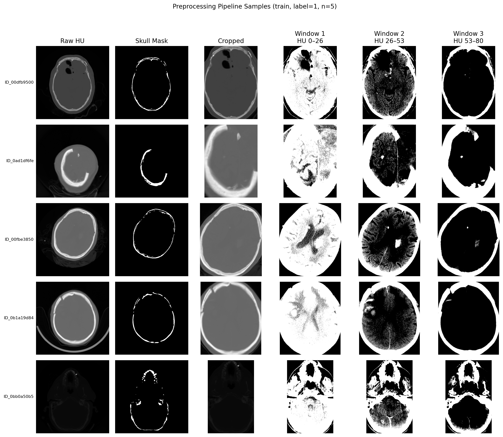
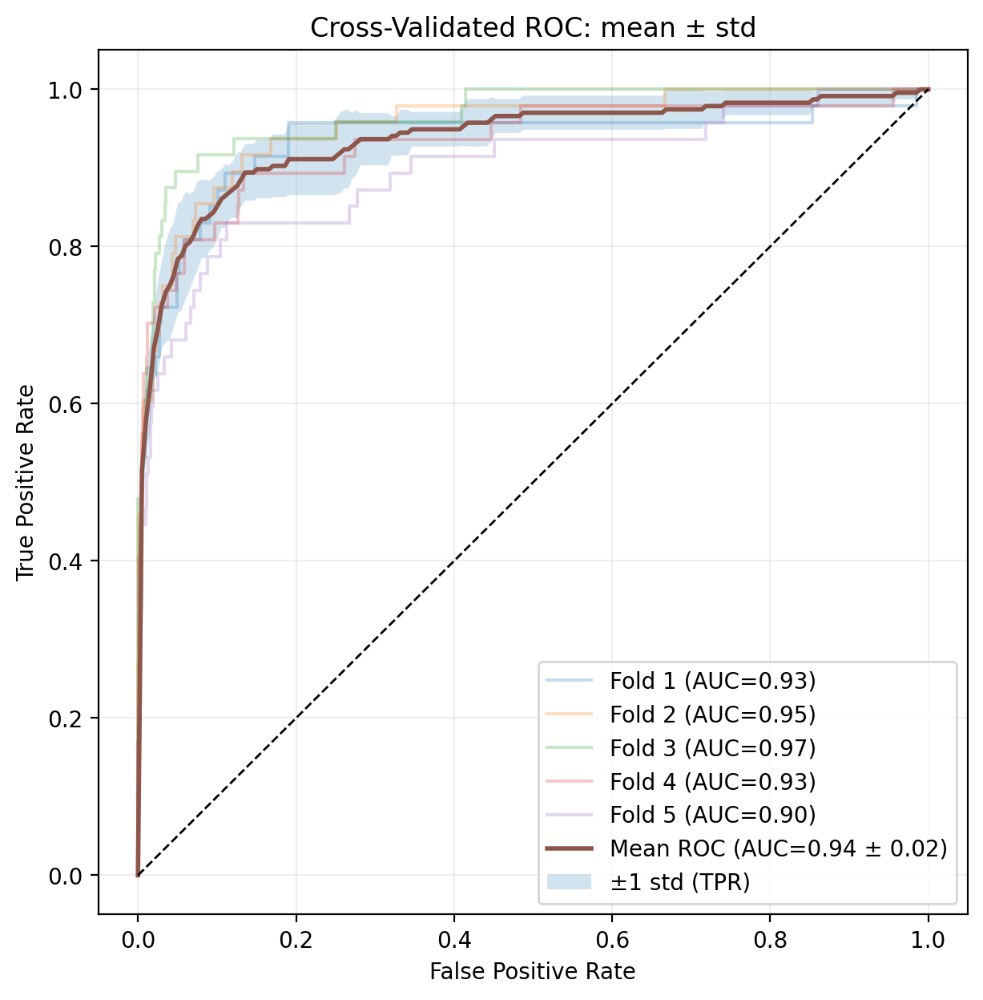
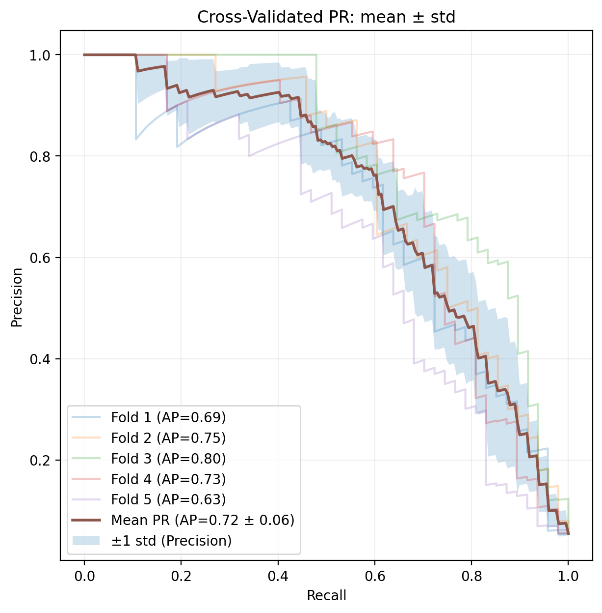
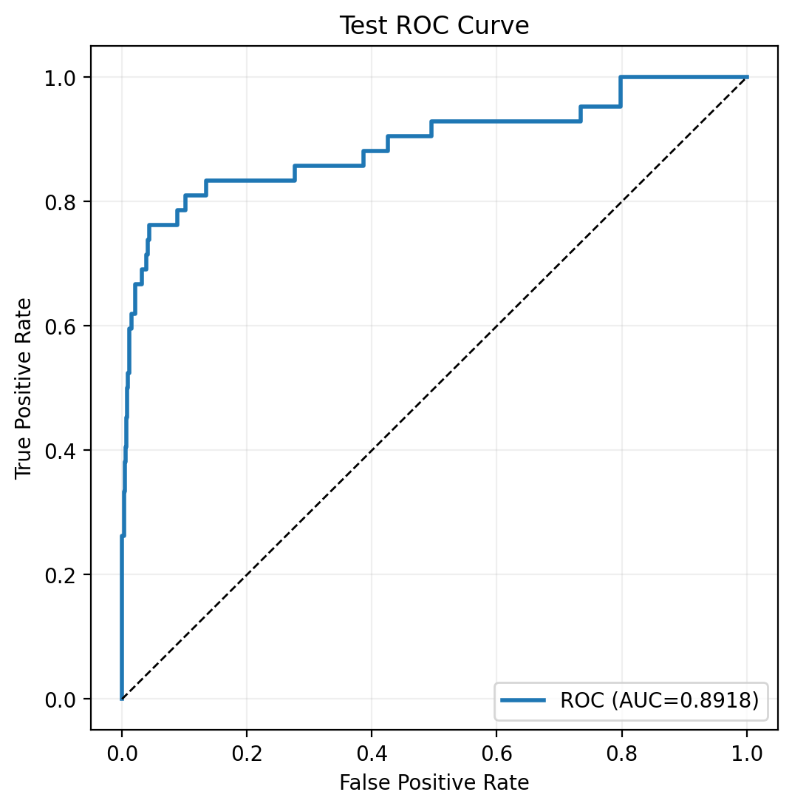
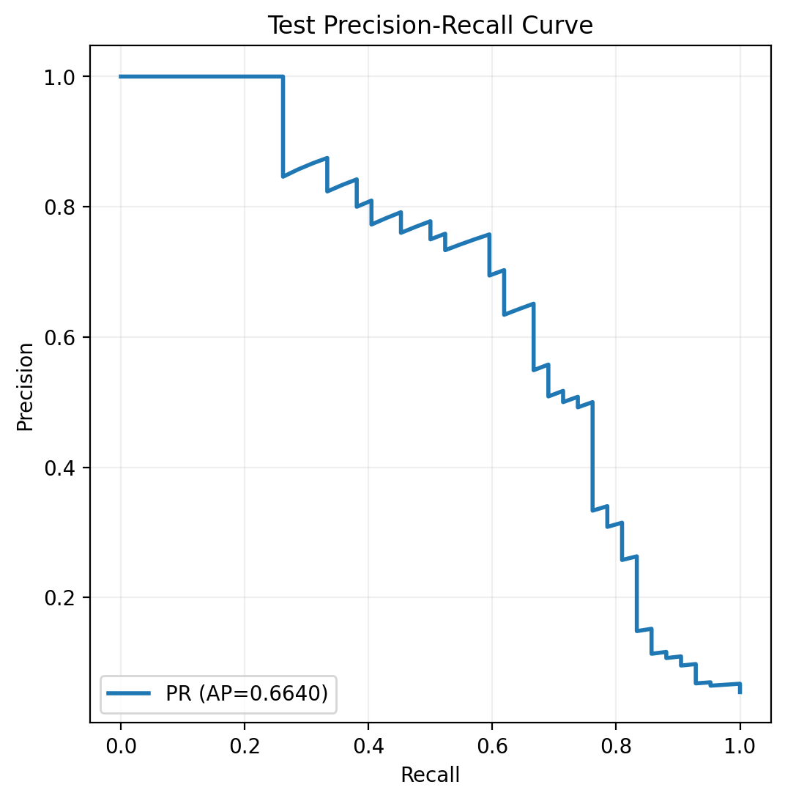

# Clinical Neuro-Oncology – Brain CT Binary Classification

End-to-end pipeline for binary classification of brain CT DICOM studies using transfer learning, with cross-validated threshold selection and sensitivity-targeted final evaluation.

## Overview

This project implements a complete, reproducible machine-learning pipeline for detecting a positive finding in brain CT scans under severe class imbalance (~17:1). The pipeline covers DICOM ingestion and HU preprocessing, multi-window image encoding, ResNet-18 transfer learning with a two-stage training protocol (head warmup → partial fine-tuning), stratified cross-validation with out-of-fold threshold analysis, and a single held-out test evaluation.

Key design decisions: multi-window HU stacking gives the model complementary tissue contrasts (edema, parenchyma, hemorrhage) as separate input channels; `WeightedRandomSampler` handles class imbalance at the loader level; threshold selection is driven by a sensitivity target to minimize missed positives, reflecting clinical cost asymmetry.

The entire pipeline runs end-to-end from a single CLI entry point (`main.py`) and saves all artifacts — features, CV curves, threshold tables, model weights, and test metrics — to a timestamped output directory.

**Quick links:**
- [Preprocessing examples](#preprocessing-pipeline)
- [CV threshold summary table](#evaluation-notes)
- [CV ROC & PR curves](#cross-validation-performance-5-fold)
- [Test ROC & PR curves](#final-test-set-performance)

---

## Repository Structure

```text
.
├── main.py                  # CLI pipeline entry point
├── src/
│   ├── preprocessing.py     # DICOM → HU conversion, skull crop, brain windowing, feature extraction
│   ├── dataset.py           # PyTorch Dataset for brain CT images
│   ├── transforms.py        # Letterbox resize, augmentation, ImageNet normalization
│   ├── models.py            # ResNet-18 binary classifier (pretrained backbone + custom head)
│   ├── training.py          # Head warmup and full fine-tuning loops (AMP, early stopping)
│   ├── cv.py                # Stratified K-Fold CV with OOF predictions and threshold tables
│   ├── final_model.py       # Final model training on all non-test data + test scoring
│   ├── eval.py              # Metrics, ROC/PR curves, preprocessing visualization
│   ├── grids.py             # Hyperparameter grid configurations
│   └── utils.py             # Dataset validation, DICOM→HU helpers, seed utility
├── notebooks/
│   └── eda.ipynb            # Full exploratory analysis and modeling walkthrough
├── outputs/                 # Generated artifacts per run (created at runtime)
├── data/                    # Dataset root (not committed)
├── README.md
└── requirements.txt
```

---

## Requirements

Tested with:
- Python 3.10+
- Linux (tested on Ubuntu / GCP VM)
- GPU recommended (CUDA); CPU fallback supported
- Python dependencies: `requirements.txt`

Install dependencies:
```bash
pip install -r requirements.txt
```

---

## Dataset Structure

The expected dataset layout is:

```
data/
├── CTs/
│   └── *.dcm          # One DICOM file per study (5122 studies)
└── labels1.csv        # ID,Label columns (Label: 0 = negative, 1 = positive)
```

The `labels1.csv` file must contain an `ID` column matching the DICOM filenames (without extension) and a `Label` column with binary labels.

**Class distribution (this dataset):**
| Class | Count | Fraction |
|---|---|---|
| Negative (0) | 4843 | 94.6% |
| Positive (1) | 279 | 5.4% |
| **Total** | **5122** | — |
| Imbalance ratio (neg/pos) | ~17.4:1 | — |

Duplicate or extra DICOM files (filenames with suffixes like ` (1).dcm`) are detected and excluded automatically during validation.

---

## How to Run

All steps are executed end-to-end via `main.py`:

```bash
python main.py --data-root data --labels labels1.csv --cts CTs
```

### Common options

| Argument | Default | Description |
|---|---|---|
| `--data-root` | `data` | Dataset root directory |
| `--labels` | `labels1.csv` | Labels CSV filename inside data-root |
| `--cts` | `CTs` | CT directory name inside data-root |
| `--seed` | `42` | Global random seed |
| `--test-size` | `0.15` | Fraction of studies held out as test set |
| `--k-folds` | `5` | Number of CV folds |
| `--batch-size` | `16` | Batch size for training |
| `--num-workers` | `4` | DataLoader and preprocessing worker count |
| `--out-size` | `256` | Spatial image size fed to the model (out_size × out_size) |
| `--threshold-strategy` | `sens_target` | `sens_target` or `max_f1` |
| `--sens-target` | `0.70` | Minimum sensitivity when using `sens_target` strategy |
| `--run-grid` | flag | Run all hyperparameter grid candidates and pick the best |
| `--config-json` | `None` | JSON file with config overrides (merged into default config) |

### Override specific hyperparameters

```bash
python main.py \
  --data-root data \
  --config-json my_config.json
```

Where `my_config.json` only needs to contain the keys you want to override (e.g. `{"lr_ft": 0.0001, "dropout_p": 0.4}`).

### Run hyperparameter grid search

```bash
python main.py --data-root data --run-grid
```

---

## Pipeline Steps

The pipeline runs 8 sequential steps:

1. **Dataset validation** — checks folder structure, DICOM count, label columns, ID↔filename alignment
2. **Feature extraction** — reads all DICOMs in parallel, extracts HU arrays and metadata
3. **Data quality checks** — missing values, duplicate IDs, error rows
4. **Train/test split** — stratified split (15% test by default), persisted for reproducibility
5. **Preprocessing visualization** — saves example grids: raw HU → skull mask → crop → 3 HU sub-windows (low/mid/high contrast)
6. **Cross-validation** — stratified K-Fold CV with warmup + fine-tuning per fold; produces OOF predictions and threshold tables
7. **Final model training** — trains on all non-test data; scores held-out test set once
8. **Done** — prints test ROC-AUC and AUPRC

---

## Preprocessing Pipeline

Each DICOM study passes through the following stages before model input:

1. **HU conversion** — pixel values are converted to Hounsfield Units using `RescaleSlope` and `RescaleIntercept`; outliers below `-1024` HU are floored.
2. **Skull mask** — a binary mask is computed from high-intensity voxels (above a percentile threshold), isolating the skull boundary.
3. **Skull-based crop** — the image is cropped to the bounding box of the skull mask, removing irrelevant background.
4. **Multi-window stacking** — the range `[center − width/2, center + width/2]` (default: `center=45, width=90` HU) is divided into 3 equal sub-ranges, each independently normalized to `[0, 1]` and stacked as separate channels:
   - Channel 1: 0–30 HU (edema / hypodense)
   - Channel 2: 30–60 HU (parenchyma / isodense)
   - Channel 3: 60–90 HU (hyperdense / hemorrhagic)

This produces a `(3, H, W)` array that encodes complementary tissue contrasts rather than three identical copies of the same image.

**Negative class examples (label 0):**



**Positive class examples (label 1):**



---

## Model

**Architecture:** ResNet-18 (pretrained on ImageNet) with custom binary head:
```
Dropout(p) → Linear(512, 1)
```

**Transform pipeline:** After preprocessing, each image passes through:

1. `ToFloatTensorCHW` — converts to `float32` tensor in `(C, H, W)` format.
2. `ResizeLetterbox` — resizes while preserving aspect ratio, then pads to `out_size × out_size` to avoid distortion.
3. `RandomAffine` + `RandomHorizontalFlip` + `GaussianBlur` *(train only)* — rotation ±15°, translation ±5%, scale 0.90–1.10, blur σ 0.1–1.5 to simulate acquisition variation.
4. `Normalize` — ImageNet mean/std per channel to align with pretrained ResNet feature scaling.
5. `RandomErasing` *(train only, after normalization)* — randomly masks rectangular patches (p=0.3, 2–15% of area) to prevent reliance on localized features.

**Training protocol:**
- Stage 1 (warmup): freeze backbone, train head only — optimizes validation AUPRC
- Stage 2 (fine-tuning): unfreeze selected layers (`ft_trainable_attrs`) or all layers — continues optimizing AUPRC
- Both stages use cosine LR annealing and label smoothing (configurable via `use_cosine_schedule` and `label_smoothing`)

**Class imbalance:** handled with `WeightedRandomSampler` (~17:1 negative-to-positive ratio)

**Default config:**
```json
{
  "optimizer": "adamw",
  "lr_head": 0.003,
  "lr_ft": 0.0001,
  "weight_decay_head": 0.00005,
  "weight_decay_ft": 0.002,
  "epochs_head": 12,
  "epochs_ft": 12,
  "patience_head": 2,
  "patience_ft": 3,
  "dropout_p": 0.4,
  "ft_trainable_attrs": ["layer3", "layer4", "fc"],
  "label_smoothing": 0.05,
  "use_cosine_schedule": true
}
```

---

## Grid Search Strategy

Hyperparameter tuning was performed using a focused, iterative grid-search process:

- **Cross-validated evaluation** for every candidate (Stratified K-Fold), using mean validation AUPRC as the primary metric.
- **Small, targeted batches** of candidates were tested rather than one large exhaustive sweep, adjusting only a few related hyperparameters per iteration to keep comparisons interpretable.
- **Selection criteria**: primary — mean validation AUPRC; secondary — fold-to-fold stability (std), threshold behavior (`df_summary`), and overfitting indicators (`auc_mean_trn` vs `auc_mean`).
- The best configuration was selected and re-run in a final CV verification pass before final model training.

All candidate configurations are defined in `src/grids.py` and can be run via `--run-grid`.

---

## Overfitting Mitigation

Given the dataset's severe class imbalance (~17:1) and limited positive examples (~279), multiple complementary strategies were applied:

| Strategy | Implementation |
|---|---|
| Stratified K-Fold CV | Preserves class ratio across folds; provides fold-level variance tracking |
| OOF threshold analysis | Thresholds selected on held-out fold data, not in-fold predictions |
| Early stopping | Patience-based stopping on validation AUPRC in both training stages |
| Two-stage training | Head warmup before fine-tuning avoids abrupt full-network overfitting |
| Layer-selective fine-tuning | `ft_trainable_attrs` limits trainable capacity during fine-tuning |
| Weight decay (separate) | Tuned independently for head and fine-tune stages |
| Dropout | Applied in classifier head (`dropout_p`) |
| WeightedRandomSampler | Balances class exposure per epoch at the sampler level |
| Data augmentation | RandomAffine, horizontal flip, GaussianBlur, RandomErasing |
| Cosine LR schedule | Decays LR smoothly to ~0 by the last epoch, reducing late-epoch memorization |
| Label smoothing | Soft targets prevent overconfident memorization of training labels |
| Protocol separation | CV for selection; final model trained once; test evaluated once |

---

## Outputs

All artifacts are saved under `outputs/run_<YYYYMMDD_HHMMSS>/`:

```
outputs/run_<id>/
├── run_args.json                        # CLI arguments used for this run
├── effective_config.json                # Final training config (after grid/JSON override)
├── features_df.pkl                      # Extracted features table
├── features_df_split.pkl                # Features table with train/test flags
├── features_checks_summary.json         # Data quality check results
├── preprocessing_examples_label0.png    # Preprocessing grid for negative class
├── preprocessing_examples_label1.png    # Preprocessing grid for positive class
├── cv_thresholds_by_fold.csv            # Per-fold, per-threshold metrics
├── cv_thresholds_summary.csv            # Aggregated mean/std metrics by threshold
├── cv_metrics.json                      # CV mean AUPRC, fold metrics, config
├── cv_mean_roc.png                      # Per-fold + mean ROC curve
├── cv_mean_pr.png                       # Per-fold + mean PR curve
├── threshold_selection.json             # Selected threshold and its metrics
├── test_predictions.csv                 # Per-study test probabilities and predictions
├── final_model_state_dict.pt            # Trained model weights
├── test_roc_curve.png                   # Test set ROC curve
├── test_pr_curve.png                    # Test set PR curve
└── test_metrics.json                    # Test ROC-AUC, AUPRC, sensitivity, PPV, F1, confusion matrix
```

Each threshold CSV contains: sensitivity, specificity, PPV, NPV, F1, balanced accuracy, AUPRC, ROC-AUC, and confusion matrix counts (TP/FP/TN/FN), with mean ± std across CV folds.

---

## Exploratory Data Analysis

Full EDA, preprocessing inspection, grid search results, and final model evaluation are available in:

```
notebooks/eda.ipynb
```

---

## Evaluation Notes

- Stratified K-Fold CV prevents label-distribution imbalance across folds
- Threshold selection is based solely on OOF CV statistics — no test data leakage
- Final test set is evaluated **once** at the end using the CV-selected threshold
- AUPRC is used as the primary optimization metric (preferred over ROC-AUC under class imbalance)
- ROC-AUC and AUPRC are always computed from **probability scores**, not hard predictions
- **Threshold selection rationale**: the operating threshold is chosen to maximize sensitivity (recall for the positive class), prioritizing detection of true positives over minimizing false positives — reflecting the clinical cost asymmetry where missing a positive case is more harmful than a false alarm. When a sensitivity target cannot be met, the threshold falls back to maximum F1.

  CV threshold summary — OOF 5-fold means ± std (threshold-independent metrics: AUPRC = 0.720 ± 0.064, ROC-AUC val = 0.936 ± 0.026, ROC-AUC trn = 1.000):

  | Thr | Sens | Sens std | Spec | Spec std | PPV | PPV std | NPV | NPV std | F1 | F1 std | Bal.Acc | Bal.Acc std |
  |---|---|---|---|---|---|---|---|---|---|---|---|---|
  | 0.05 | 0.869 | 0.052 | 0.891 | 0.038 | 0.328 | 0.067 | 0.992 | 0.003 | 0.472 | 0.070 | 0.880 | 0.022 |
  | 0.10 | 0.805 | 0.078 | 0.934 | 0.026 | 0.429 | 0.104 | 0.988 | 0.005 | 0.554 | 0.093 | 0.869 | 0.039 |
  | 0.15 | 0.767 | 0.076 | 0.953 | 0.019 | 0.500 | 0.094 | 0.986 | 0.004 | 0.600 | 0.068 | 0.860 | 0.034 |
  | 0.20 | 0.734 | 0.055 | 0.961 | 0.016 | 0.537 | 0.094 | 0.984 | 0.003 | 0.614 | 0.056 | 0.847 | 0.022 |
  | 0.25 | 0.709 | 0.071 | 0.967 | 0.016 | 0.572 | 0.104 | 0.983 | 0.004 | 0.625 | 0.048 | 0.838 | 0.029 |
  | 0.30 | 0.704 | 0.077 | 0.971 | 0.014 | 0.604 | 0.108 | 0.983 | 0.004 | 0.642 | 0.049 | 0.838 | 0.033 |
  | 0.35 | 0.692 | 0.061 | 0.974 | 0.013 | 0.629 | 0.102 | 0.982 | 0.003 | 0.651 | 0.041 | 0.833 | 0.025 |
  | 0.40 | 0.679 | 0.066 | 0.976 | 0.013 | 0.646 | 0.111 | 0.981 | 0.004 | 0.654 | 0.048 | 0.828 | 0.028 |
  | 0.45 | 0.650 | 0.081 | 0.980 | 0.011 | 0.676 | 0.105 | 0.980 | 0.004 | 0.654 | 0.037 | 0.815 | 0.036 |
  | 0.50 | 0.625 | 0.085 | 0.983 | 0.009 | 0.694 | 0.099 | 0.979 | 0.005 | 0.649 | 0.037 | 0.804 | 0.039 |
  | 0.55 | 0.603 | 0.083 | 0.985 | 0.010 | 0.717 | 0.120 | 0.977 | 0.005 | 0.646 | 0.047 | 0.794 | 0.038 |
  | 0.60 | 0.591 | 0.075 | 0.986 | 0.008 | 0.735 | 0.111 | 0.977 | 0.004 | 0.647 | 0.036 | 0.789 | 0.034 |
  | 0.65 | 0.574 | 0.075 | 0.987 | 0.008 | 0.743 | 0.110 | 0.976 | 0.004 | 0.639 | 0.035 | 0.781 | 0.035 |
  | 0.70 | 0.549 | 0.069 | 0.988 | 0.007 | 0.745 | 0.102 | 0.974 | 0.004 | 0.624 | 0.021 | 0.768 | 0.031 |
  | 0.75 | 0.527 | 0.076 | 0.990 | 0.006 | 0.773 | 0.106 | 0.973 | 0.004 | 0.619 | 0.031 | 0.759 | 0.035 |
  | 0.80 | 0.515 | 0.078 | 0.992 | 0.006 | 0.819 | 0.120 | 0.973 | 0.004 | 0.624 | 0.041 | 0.754 | 0.037 |
  | 0.85 | 0.489 | 0.073 | 0.994 | 0.004 | 0.843 | 0.100 | 0.971 | 0.004 | 0.613 | 0.047 | 0.742 | 0.035 |
  | 0.90 | 0.447 | 0.075 | 0.996 | 0.004 | 0.875 | 0.090 | 0.969 | 0.004 | 0.586 | 0.053 | 0.722 | 0.036 |
  | 0.95 | 0.355 | 0.097 | 0.998 | 0.002 | 0.918 | 0.068 | 0.964 | 0.005 | 0.503 | 0.090 | 0.676 | 0.047 |

---

## Results

### Cross-Validation Performance (5-Fold)

| Metric | Mean | Std |
|---|---|---|
| AUPRC | 0.720 | ±0.064 |
| ROC-AUC | 0.936 | ±0.026 |





### Final Test Set Performance

Threshold selected from CV summary using `sens_target` strategy (minimum sensitivity ≥ 0.70).

| Metric | Value |
|---|---|
| ROC-AUC | 0.892 |
| AUPRC | 0.664 |
| Threshold | 0.30 |
| Sensitivity | 0.690 |
| PPV | 0.527 |
| F1 | 0.598 |
| TP / FP / TN / FN | 29 / 26 / 701 / 13 |





---

## Environment

All experiments were executed on a Google Cloud Platform (GCP) virtual machine running Ubuntu 22.04 (x86_64), with GPU acceleration (CUDA).

---

## Author

Yonatan Jenudi
MD | Data Scientist
